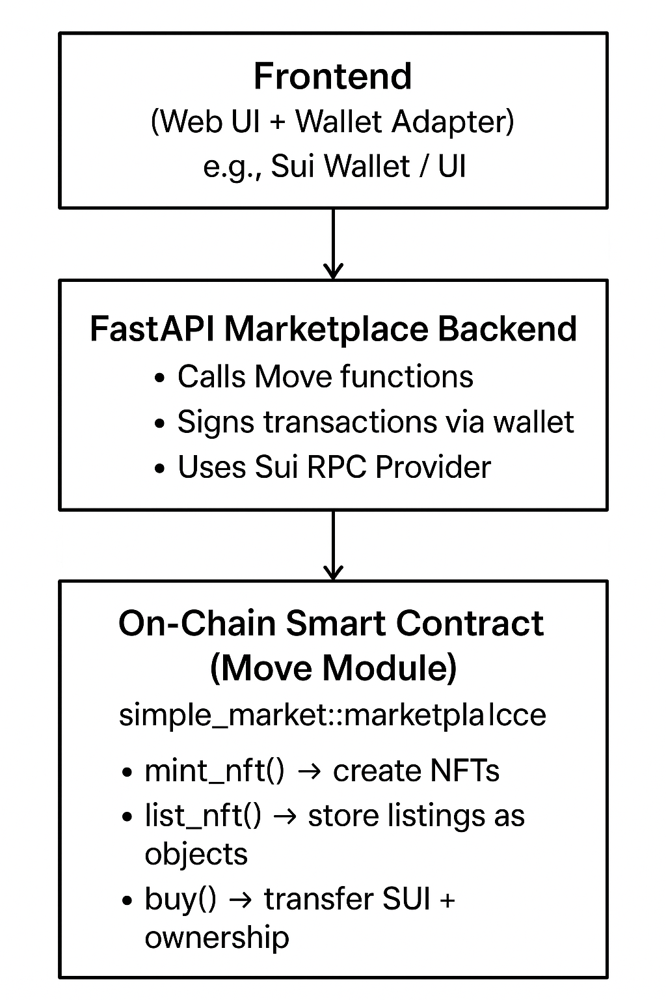

# Simple NFT Marketplace on SUI 🛒

A basic on-chain marketplace built using **Move language**, **FastAPI backend**, and **Python Sui SDK**, enabling users to mint NFTs, list them for sale, and buy NFTs with SUI tokens.

---

## 🏗 Architecture

```
Frontend  →  Backend (FastAPI + Sui-Python SDK) → SUI Smart Contract (Move)
```

---

## 🧾 Smart Contract

Located at:

```
move/sources/simple_market.move
```

Implements:

* ✔ Mint new NFTs
* ✔ List NFT for sale
* ✔ Buy NFT with SUI payment
* ✔ Emits events (Mint, List, Buy)

---


## 🌐 Backend API

| Endpoint    | Method | Description                           |
| ----------- | ------ | ------------------------------------- |
| `/mint`     | POST   | Mint a new NFT                        |
| `/list`     | POST   | List owned NFT for sale               |
| `/buy`      | POST   | Buy a listing using SUI               |
| `/listings` | GET    | (Not Implemented) Fetch live listings |

---

###  Architecture Diagram



---

## 🚀 How To Run

### 1️⃣ Install Prerequisites

* Python **3.10+**
* Move CLI & Sui Wallet
* Git

### 2️⃣ Clone the repo

```bash
git clone https://github.com/<your-username>/<your-repo>.git
cd <your-repo>
```

### 3️⃣ Install Python Dependencies

```bash
pip install fastapi uvicorn sui-python-sdk pydantic
```

### 4️⃣ (Optional) Set RPC Node

```bash
export SUI_RPC_URL=https://fullnode.devnet.sui.io
```

### 5️⃣ Start Backend Server

```bash
uvicorn main:app --reload
```

Server runs at:
👉 `http://localhost:8000/docs` (Swagger UI)

---

## 💻 Testing the API

### 🔹 Mint NFT

```bash
curl -X POST http://localhost:8000/mint \
-H "Content-Type: application/json" \
-d '{"name":"Dragon","owner":"0xabc"}'
```

### 🔹 List NFT

```bash
curl -X POST http://localhost:8000/list \
-H "Content-Type: application/json" \
-d '{"nft_id":"<PUT_ID>","price":2000000,"seller":"0xabc"}'
```

### 🔹 Buy NFT

```bash
curl -X POST http://localhost:8000/buy \
-H "Content-Type: application/json" \
-d '{"listing_id":"<PUT_ID>","buyer":"0x123","payment_id":"<COIN_ID>"}'
```

---

## ⚠️ Limitations

* ❌ No UI frontend (only backend + smart contract)
* ❌ `GET /listings` not implemented
* ❌ Buyer must manually provide `payment_id`
* ❌ No NFT metadata (images/file storage)
* ❌ No royalties or advanced features

---

## 🎯 Future Improvements

* 🔄 Automatic coin selection
* 📡 Implement `/listings` using event queries or indexer
* 🖼 NFT metadata with IPFS/Arweave
* 💸 Creator royalties
* 🛍 React/Next.js UI

---

🚀 **Built for Web3 developers exploring the Sui ecosystem!**
